# 단어 놀이 팡!

- 프로젝트 소개
- 주요 기능 시나리오
- 특징

---

## 프로젝트 소개

- 한 줄 소개
    
    **단어놀이 팡!** 은 움직이는 단어를 활용하여 단어를 학습하는 웹사이트입니다.
    
- 배경
    
    유아는 놀이를 통해 자아를 발견하고, 주변 사물 및 다른 사람을 이해하며, 적절한 사회적 역할을 수행하기 위한 정보를 습득합니다. 그러나 최근에는 올라가는 장난감 비용이 상승하면서, 유아들이 놀이를 통해 자연스럽게 학습하기가 어려워졌습니다. 또한, 코로나19로 인해 유아의 언어 발달이 지연되는 사례가 증가하고 있습니다. 이에 따라, 저희의 ‘**단어놀이 팡!**’은 유아들의 언어 발달을 촉진하고 놀이를 통한 학습을 돕는 데에 유용한 도구가 될 수 있습니다. 이 앱은 유아는 움직이면서 놀이를 즐기는 것을 좋아하므로 다양한 움직임과 놀이를 활용하여 단어 암기를 할 수 있도록 다양한 놀이 방법을 활용하여 구성되고. 또한, 무료로 제공되어 더 많은 사람들이 이용할 수 있도록 기획하였습니다.
    

---

## 주요 기능 시나리오

- 개요
    
    
    | 기준 | 내용 |
    | --- | --- |
    | 누가 | 유치원생 (4~7 세) |
    | 언제 | 재미있게 쉬운 단어 암기를 하고 싶을 때 |
    | 무엇을 | 놀이를 통한 단어 암기 |
    | 어떻게 | 클릭이나 캐릭터의 움직임을 사용해서 |
    | 왜 | 무료로 움직임을 통한 효과적인 단어를 암기할 수 있음 |
- 주요 기능
    - 낚시 게임
        
        마우스 커서를 따라 움직이는 낚시대를 이용해 자신이 원하는 해양생물을 클릭하여 획득합니다.
        
    - 과일 게임
        
        랜덤으로 나왔다 사라지는 과일을 클릭하여 과일을 획득합니다.
        
    - 순서 게임
        
        랜덤으로 배치한 5마리 동물을 5초간 보여주고 사라지면 앞서 배치한 동물들을 순서대로 맞춰서 동물을 획득합니다.
        
    - 도감
        
        자신이 획득한 단어 내용을 다시 살펴볼 수 있습니다.
        
- 시나리오
    
    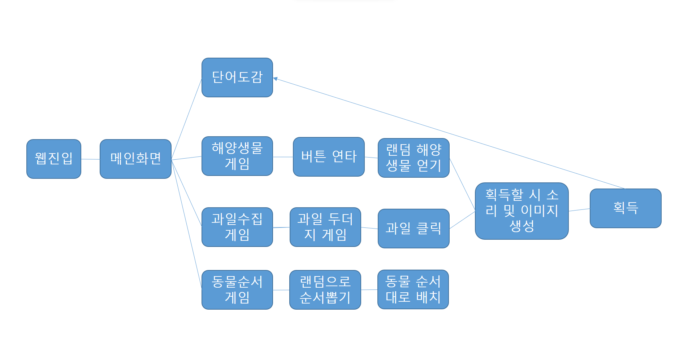
    

---

## 특징
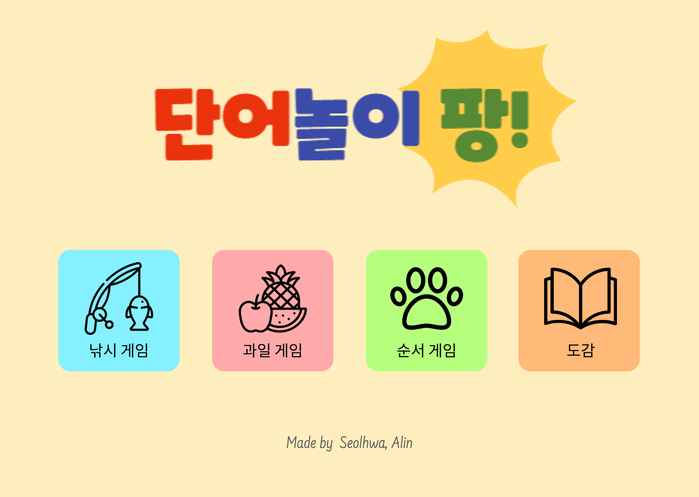
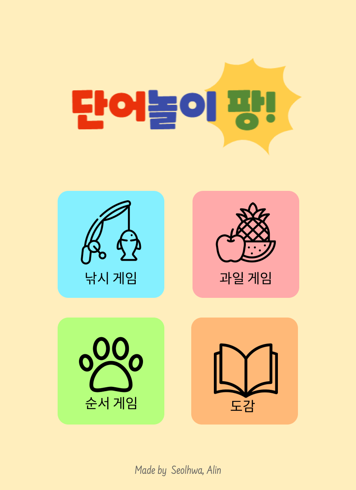
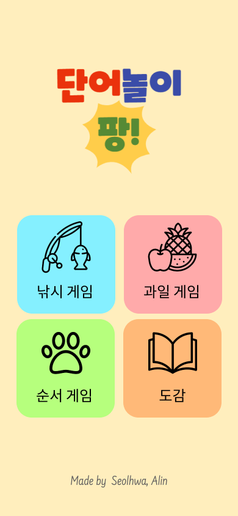

데스크탑 → 탭, 스마트폰 : 버튼이 1줄에서 2줄로 변경  
데스크탑, 탭 → 스마트폰 : 로고 이미지 변경

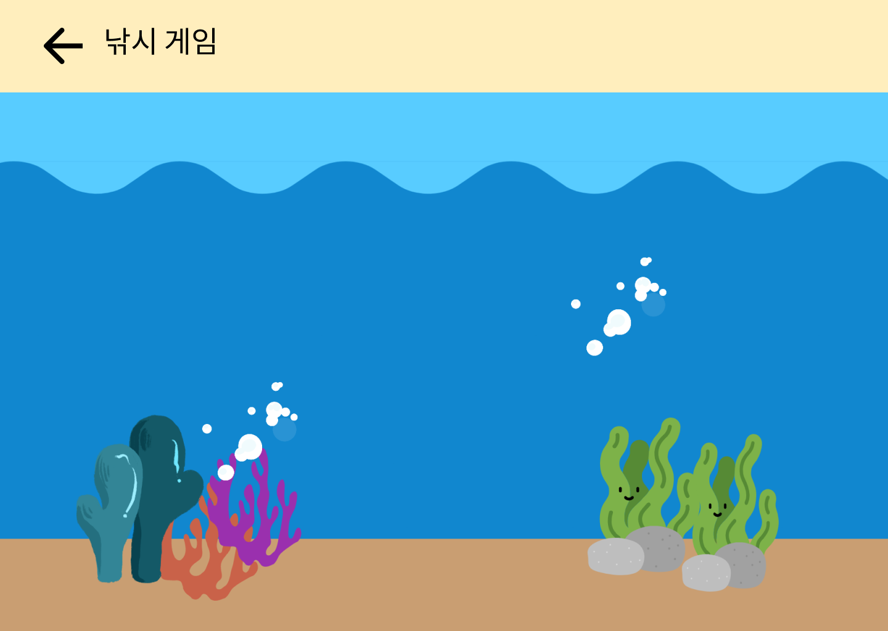
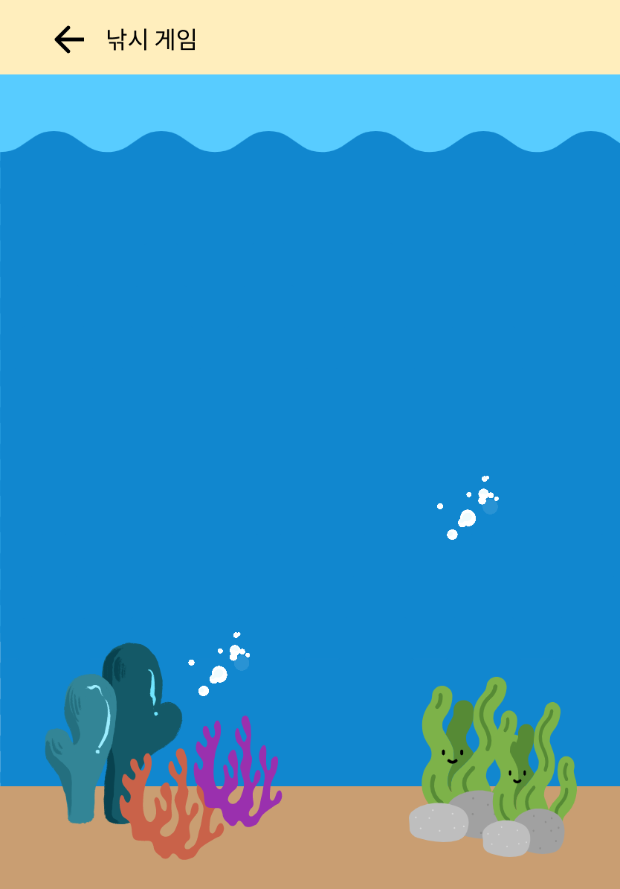
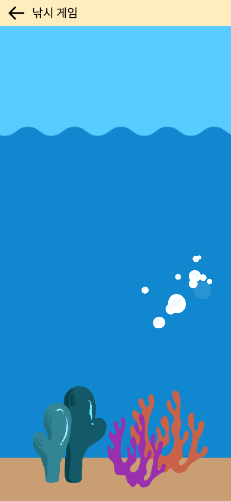

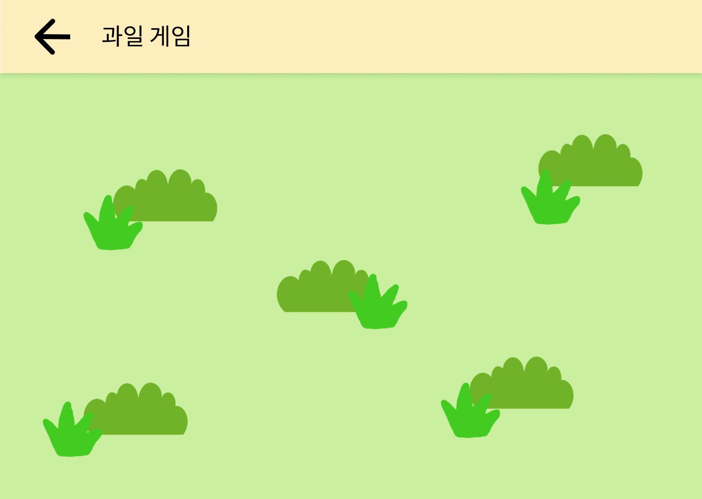
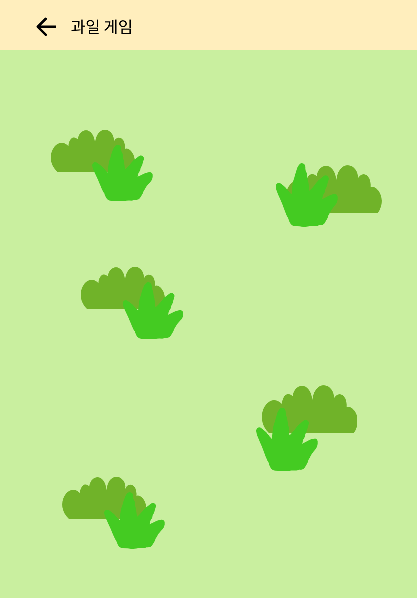
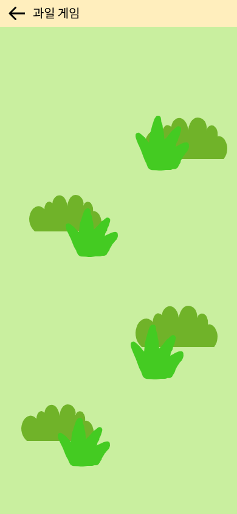

각각 사이즈마다 이미지가 변경됨 
게임 내에 이미지 사이즈 줄어듬

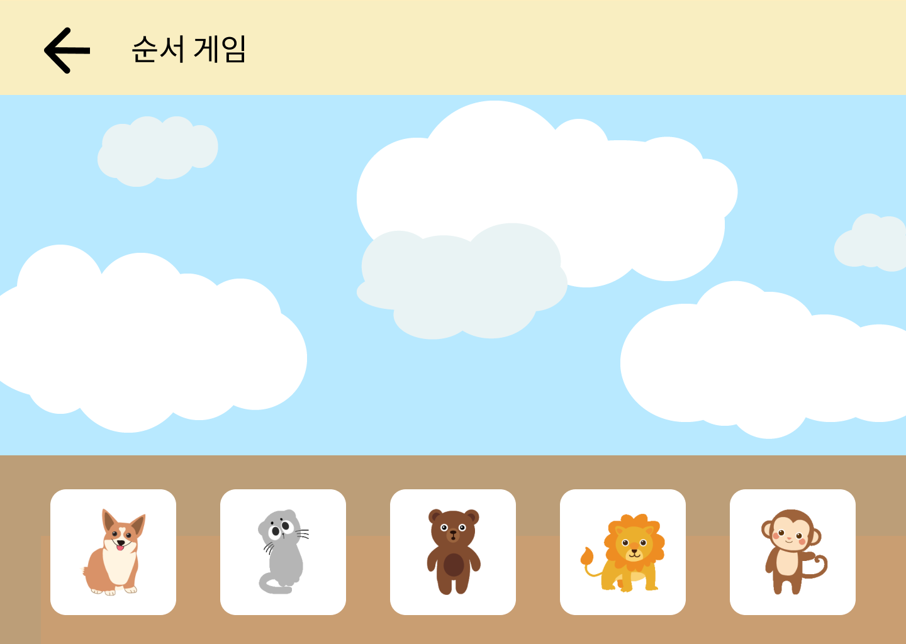
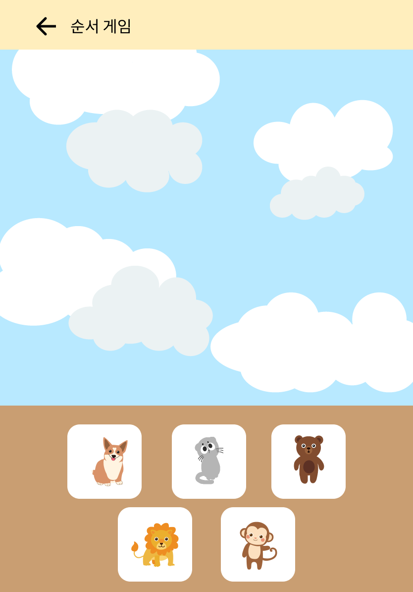
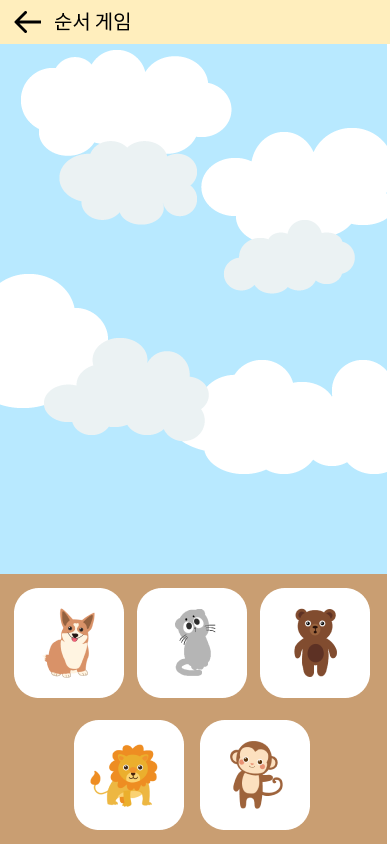

데스크탑 → 탭, 스마트폰 : 버튼 1줄 → 2줄 변경 
각각의 사이즈마다 배경 변경